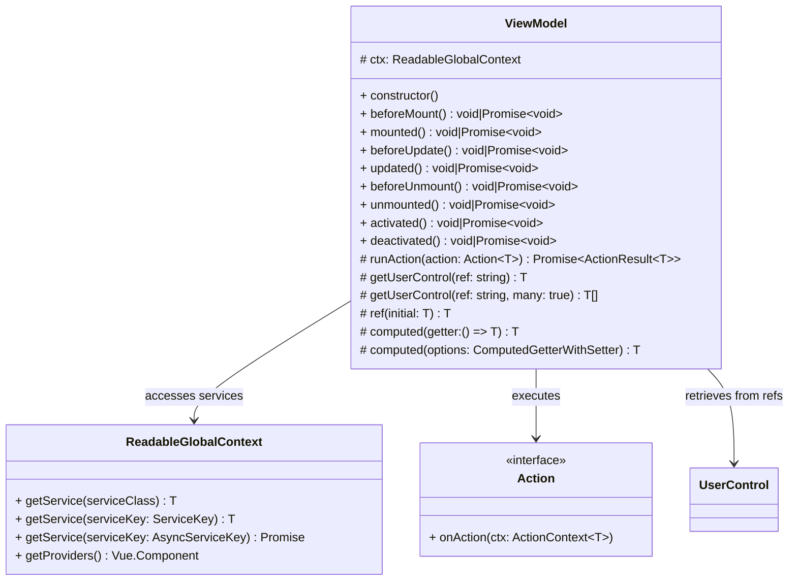

# ViewModel

- [ViewModel](#viewmodel)
  - [Lifecycle Hooks](#lifecycle-hooks)
    - [Asynchronous Lifecycle Methods](#asynchronous-lifecycle-methods)
  - [Accessing GlobalContext](#accessing-globalcontext)

ViewModels are the core abstraction in the `vue-mvvm` framework, serving as the intermediary
layer between Vue components (Views) and business logic (Services).

A ViewModel encapsulates presentation logic, manages UI state, coordinates with services
through dependency injection, declares lifecycle hooks that mirror Vue's component
lifecycle, and provides wrapper methods for VUe's reactivity functions.



## Lifecycle Hooks

The `ViewModel` class providies the following lifecycle methods, each corresponding 
to a specific Vue component lifecycle stage:

| ViewModel Methods | Vue Hook            | Timing                                          |
| ----------------- | ------------------- | ----------------------------------------------- |
| `beforeMount`     | `onBeforeMount`     | Before component is mounted to the DOM          |
| `mounted`         | `onMounted`         | After components is mounted to DOM              |
| `beforeUpdate`    | `onBeforeUpdate`    | Before reactive state changes trigger re-render |
| `updated`         | `onUpdated`         | After reactive state changes and DOM updates    |
| `beforeUnmounted` | `onBeforeUnmounted` | Before component is unmounted                   |
| `unmounted`       | `onUnmounted`       | After component is unmounted                    |
| `activated`       | `onActivate`        | When keep-alive component is activated          |
| `deactivated`     | `onDeactivated`     | When keep-alive component is deactivated        |

### Asynchronous Lifecycle Methods

All lifecycle methods can return either `void` or `Promise<void>`. While asynchronous
lifecycle methods are supported, Vue does not await for them to complete before proceeding
with the component lifecycle. If you need to ensure asynchronous operations complete
before certain UI interactions are enabled, consider using a loading state variable.

## Accessing GlobalContext

Every ViewModel instance has access to a protected, readonly field called `ctx` of type `ReadableGlobalContext`.

The method `getService` retrieves service instances from the global dependency injection container.
It accepts a service class constructor, a `ServiceKey` or an `AsyncServiceKey` as its parameter and returns a fully-typed instance of that service.

```typescript
import {FooService} from "@servides/foo.service";

export class MyViewModel extends ViewModel {
    private readonly fooService: FooService;

    public constructor() {
        super();

        this.fooService = this.ctx.getService(FooService);
    }
}
```
