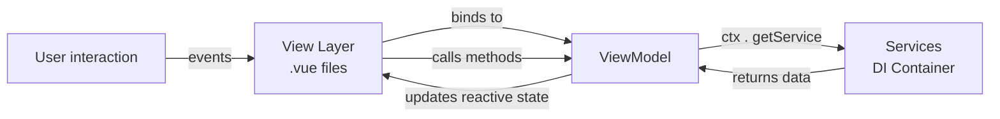

# Core Concepts

- [Core Concepts](#core-concepts)
    - [MVVM Architecture](#mvvm-architecture)
    - [ViewModel](#viewmodel)
    - [UserControl](#usercontrol)
    - [Action Pattern](#action-pattern)
    - [Dependency Injection](#dependency-injection)
    - [Communication Pathways](#communication-pathways)

## MVVM Architecture

The framework implements a strict separation between presentation and logic through three distinct layers

| Layer         | Responsibility                                      | Implementation                            |
|---------------|-----------------------------------------------------|-------------------------------------------|
| **View**      | UI rendering and user interaction                   | Vue Single File Components (`.vue`) files |
| **ViewModel** | Presentation logic, state management, orchestration | TypeScript classes extending `ViewModel`  |
| **Model**     | Business logic and data access                      | Services registered in the DI container   |

## ViewModel

The ViewModel class is the foundational abstraction providing:

- **Lifecycle Hooks:** Methods that map to Vue component lifecycle hooks (beforeMount, mounted, beforeUpdate,
  updated, ...)
- **Context Access:** Protected `ctx` property providing access to the DI container
- **Action Execution:** `runAction<T>(action)` method for executing asynchronous operations
- **UserControl Access:** `getUserControl<T>(ref)` method for retrieving UserControl instances from Vue template refs

## UserControl

The UserControl class extends ViewModel to encapsulate reusable UI logic that is too complex for a single ViewModel.
Common use cases included:

- Complex form components with validation
- Reusable data grids or lists

UserControls are instantiated via the `useUserControl` hook and exposed to the parent ViewModels through a unique symbol
mechanism.

## Action Pattern

The Action interface provides a standardized pattern for handling operations that produce results such as form
submission.

The pattern handles both synchronous and asynchronous implementations uniformly.

## Dependency Injection

The framework provides a lightweight DI container through the `GlobalContext`, accessible to all ViewModels via the
protected `ctx` property.

| Interface               | Available To                    | Purpose                                        |
|-------------------------|---------------------------------|------------------------------------------------|
| `WritableGlobalContext` | `configureServices` in AppShell | Service registration during app initialization |
| `ReadableGlobalContext` | ViewModels, DI FactoryFunctions | Service consumption during runtime             |

This separation prevents ViewModels from registering services at runtime, enforcing a clear initialization phase.

## Communication Pathways

1. **View -> ViewModel:** Direct method calls and reactive property bindings
2. **ViewModel -> Service:** Via `ctx.getService(ServiceClass)`
3. **ViewModel -> UserControl:** Via `getUserControl<T>(ref)` using Vue template refs
4. **ViewModel -> UserControl:**  Via `Delegate` for type-safe event broadcasting
5. **ViewModel -> Action&lt;T>:** Via `runAction(action)`
6. **ViewModel -> View:** Via `Delegate` for type-safe event broadcasting
