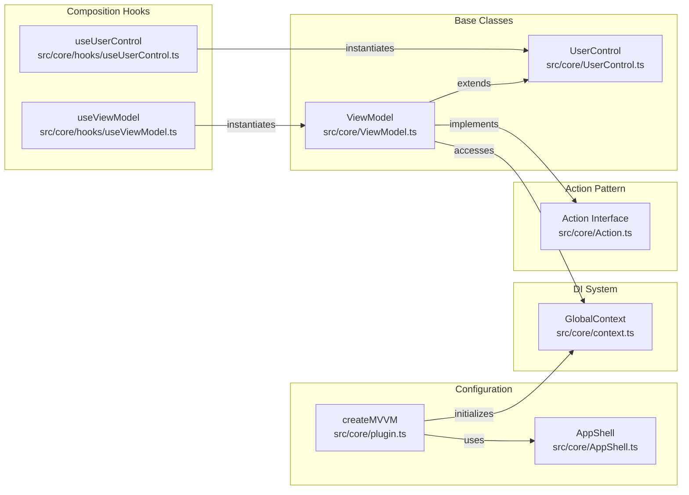

# Overview

- [Overview](#overview)
  - [Purpose and Scope](#purpose-and-scope)
  - [Package Structure](#package-structure)
    - [Distribution Format](#distribution-format)
    - [Peer Dependencies](#peer-dependencies)
  - [Core Components](#core-components)
    - [Base Classes](#base-classes)
    - [Composition Hooks](#composition-hooks)
    - [Infrastructure](#infrastructure)
  - [Data Flow](#data-flow)
  - [Design Philosophy](#design-philosophy)

## Purpose and Scope

`vue-mvvm` is a lightweight MVVM (Model-View-ViewModel) framework for Vue 3 applications. It provides typed ViewModels, reusable UserControls, and a minimal dependency injection container.

**Current Status:** `vue-mvvm` is in early-stage development (version 0.3.0). Not all features may be stable in production environments and implementations can change rapidly.

## Package Structure

`vue-mvvm` is distributed as three separate entry points to support modular adoption:

| Module | Import Path       | Purpose                                                       |
| ------ | ----------------- | ------------------------------------------------------------- |
| Core   | `vue-mvvm`        | Essential MVVM utilities                                      |
| Router | `vue-mvvm/router` | Plugin to enable ViewModel routing using `vue-router` package |
| Dialog | `vue-mvvm/dialog` | Plugin for easy dialog management from ViewModel code         |

Any module beyond Core is optional and will be tree-shaken when unused.

### Distribution Format

- **Module Format:** ESM with `.mjs` extension
- **Type Declarations:** TypeScript declaration files (`*.d.ts`)
- **Build Tool:** `tsdown` with `rolldown` bundler
- **Tree-Shaking:** Unbundled output for optimal tree-shaking

### Peer Dependencies

- `vue`: ^3.5.24
- `vue-router`: ^4.6.3 (only required when using `vue-mvvm/router`)
  
## Core Components

### Base Classes

| Class         | Purpose                                                                                |
| ------------- | -------------------------------------------------------------------------------------- |
| `ViewModel`   | Base class providing lifecycle hooks, context access and action execution capabilities |
| `UserControl` | Extends `ViewModel` for reusable UI Components with encapsulated logic                 |

### Composition Hooks

| Hook             | Purpose                                                                 |
| ---------------- | ----------------------------------------------------------------------- |
| `useViewModel`   | Instantiates ViewModels and bind their lifecycle to Vue components      |
| `useUserControl` | Instantiates UserControls and exposes them via symbol for parent access |

### Infrastructure

| Component       | Purpose                                                                              |
| --------------- | ------------------------------------------------------------------------------------ |
| `createMVVM`    | Initializes the application, configures DI container, and registers plugins          |
| `GlobalContext` | Dependency injection container with service registry and lazy instantiation          |
| `Action`        | Interface for asynchronous operations between ViewModels returning `ActionResult<T>` |
| `AppShell`      | Configuration interface for core and any used plugin                                 |

## Data Flow

1. **View Layer:** Pure presentation — templates bind to ViewModel properties and call methods
2. **Integration Layer:** Composition hooks bridge Vue's reactivity system with ViewModel instances
3. **Presentation Layer:** ViewModels manage UI state and orchestrate business operations
4. **Business Layer:** Services contain reusable business logic accessed via dependency injection
5. **Infrastructure Layer:** Framework utilities for DI and async operations

This separation enables:

- **Testability:** ViewModels can be unit tested without rendering components
- **Reusability:** UserControls and Services can be shared across multiple views
- **Maintainability:** Clear boundaries between UI, presentation, and business logic
- **Type Safety:** Full TypeScript support throughout all layers

## Design Philosophy

- **Lightweight:** Small API surface with minimal abstractions
- **Incremental Adoption:** Use as much as or little as needed
- **Type Safety:** Leverages TypeScript for compile-time guarantees
- **Vue-Native:** Built on Vue 3 Composition API
- **Testable:** Clear separation enables isolated unit testing
